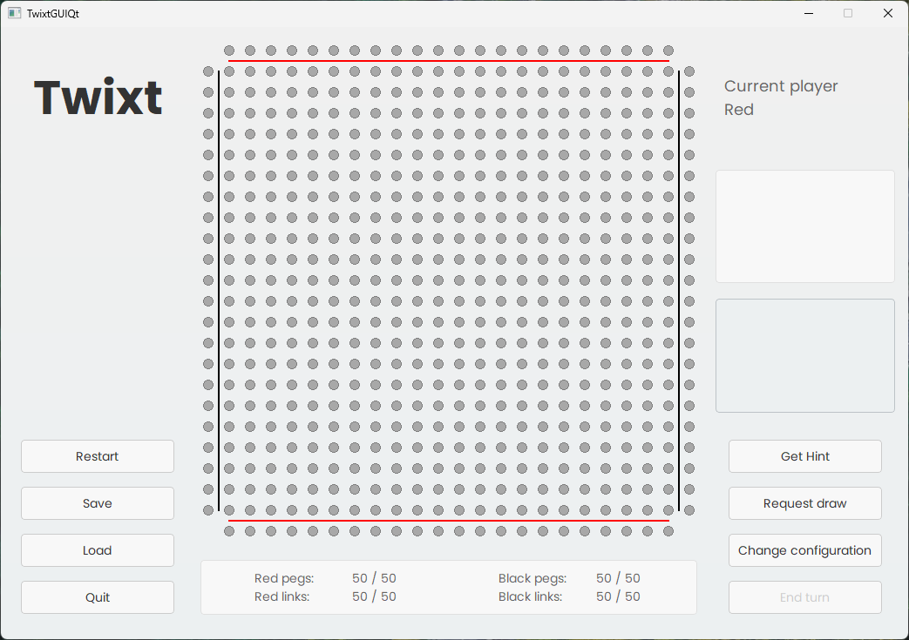

# Twixt - A C++ Implementation of the Classic Board Game

## Overview

Twixt is a C++ implementation of the classic board game "Twixt". This project includes both the game logic (TwixtLib) and unit tests (TwixtTests). Twixt is a strategic board game played by two players who take turns placing pegs on a grid and connecting them to form a path from one side of the board to the other.

## Motivation

The motivation behind creating this project was to provide a digital implementation of the Twixt game, allowing enthusiasts to play the game on their computers. Additionally, building this project served as an opportunity to enhance skills in C++ programming, game development, and software testing.

## Features

- **Game Logic**: The TwixtLib folder contains the core logic for playing the game, including classes for the game board, players, pieces, links, and game rules.
- **Unit Tests**: TwixtTests folder contains unit tests written using the Google Test framework to ensure the correctness of the game logic implementation.
- **Player Interaction**: Players can place pegs on the board and create links to connect them.
- **Game Ending**: The game can end in three possible outcomes: Red Player Wins, Black Player Wins, or Draw.

## Getting Started

To run Twixt, you'll need to have the following dependencies installed on your system:

### 1. Qt Framework (Version 6.6.1)

Twixt is built using the Qt framework, version 6.6.1, which provides cross-platform support for GUI applications. You can download and install Qt 6.6.1 from the official website: [Qt Downloads](https://www.qt.io/download).

Make sure to install the Qt 6.6.1 version for your operating system. Once Qt is installed, you'll need to configure it for development with C++. Refer to the Qt documentation for detailed instructions on setting up Qt with your preferred development environment.

### 2. gmock Nugget Package

Twixt also uses the gmock package for unit testing. gmock is a C++ testing framework developed by Google. You can install gmock using the Nugget package manager.

To install gmock using Nugget, run the following command in your terminal:

`nugget install gmock`

Once you have installed the dependencies, you can proceed to build and run Twixt as described above.

To get started with Twixt, follow these steps:
1. Clone the repository to your local machine.
2. Open the solution file (muschetari-mcpp.sln) in Visual Studio.
3. Build the solution.
4. Run the unit tests to verify the correctness of the game logic.
5. Explore the code to understand the implementation details.

## How to Play

- **Setup**: Players decide who goes first. The game board is initially empty.
- **Turns**: Players take turns placing one peg of their color on any empty intersection of the board grid.
- **Links**: After placing a peg, players can create links by connecting their own pegs orthogonally or diagonally.
- **Victory**: The game ends when a player creates an uninterrupted path of linked pegs from one side of the board to the other with their color. The player with the longest continuous path wins.

## Contributing

Contributions to Twixt are welcome! If you find any bugs or have suggestions for improvements, please open an issue or submit a pull request.

## License

This project is not licensed and comes with no warranty or guarantee of any kind. You are free to view and fork the code for personal and educational purposes, but any use beyond that may require explicit permission from the project contributors.

## Team members
Name                         | GitHub Profile                                | Contributions
-----------------------------|-----------------------------------------------|-------------------------------------------
Aparascai Andreea-Madalina   | [AndreeaAM](https://github.com/AndreeaAM)     | Backend development
Constandoiu Cezar            | [ccaesar26](https://github.com/ccaesar26)     | Project management, frontend development
Filip Andrei                 | [GitStroberi](https://github.com/GitStroberi) | Project management, backend development
Tigau George-Corinel         | [GeorgeTig](https://github.com/GeorgeTig)     | Testing

Enjoy playing Twixt! ❤️
